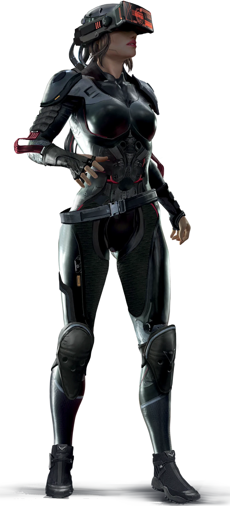

---
tags:
  - 💻Trilha-Redes
aliases:
  - Netrunner
  - Trilha-Redes
---
>“Foi **fácil** para o Bartmoss. Ele relaxou em uma geladeira enquanto sua mente vagava por todo o planeta e, graças a ele, eu nunca vou ter essa porra de **luxo**. Para quebrar um sistema, tenho que mover minha **carne** para poder conectar-me no local. Certo, talvez eu encontre um **Cão Infernal**, mas eles não aceleram o meu coração. Eu tenho a habilidade e os programas para lidar com esses filhotes. Eles não são problema. Sabe o que me **assusta**? Cães reais. Clonados chipados e ciberizados para serem **piores** que qualquer GELO Negro. É por isso que eu sempre trabalho com amigos. Eles cuidam dos cães reais. Eu cuido dos Cães Infernais. **Simbiose** em sua melhor forma"
>Redeye, Trilha-Redes

Você é um hacker frenético do computador e mestre do ciberverso Pós-Rede no Tempo do Vermelho. Aos três anos, seus pais lhe comparam um velho ciberdeque Kirama LPD-12 com óculos ópticos Zetatech 526 (você era muito jovem para plugues de interface), e sua vida mudou. Na quinta série, você já estava usando uma metaprogramação REFRAME-G1s para hackear o sistema do distrito escolar e mudar suas notas. Quando tinha treze anos, você transferiu dinheiro suficiente do sistema de contas desprotegido do Banco TransUnião para financiar seu primeiro implante de interface neural. Você não podia esperar para conseguir acompanhar os outros deuses da Rede - Bartmoss, Magnífico Curtis e o resto deles. Então a Quarta Guerra Corporativa explodiu a Velha Rede. A R.A.I.V.A. fez com viajar pela Rede fosse um trilha suicida; os Nodos foram fragmentados ou corrompidos. Mas ainda havia lugares para trilhar. Você só tinha que ir lá e entrar do jeito difícil. Você trocou estar sentado no seu sofá por uma armadura corporal pesada de combate e óculos de interface Virtuality5 para mesclar a Rede com o Carnespaço. Os sistemas que você quebrou eram pequenos, mas ainda perigosos. Agora você faz parte de uma equipe, com Solos para te proteger, Tecnomédico para cuidar do seu coração se o GELO te pegar, e Técnicos para ajudá-lo conectando-se ao ciberdeque, para conseguir mais velocidade e para a implementação de programas. Agora nada pode te parar. Como um espectro eletrônico, você invade com facilidade os sistemas de mainframe “mais difíceis”: roubando, negociando e vendendo seus segredos à vontade. No fim das contas pode ser que o GELO Negro ainda te mate, mas, até que a trilha acabe, você estará lá, com o cérebro aberto e mergulhando de cabeça na Nova Rede.
# Habilidade de Cargo: Interface

A habilidade de Cargo do Trilha-Redes é Interface. Interface é o que lhe permite Correr na Rede - fazer a interface com modems mentais eletrônicos (chamados ciberdeques) para controlar computadores, eletrônicos e seus programas associados. A Habilidade de Cargo Interface também concede ao Trilha-Redes acesso a um amplo conjunto de habilidades relacionados a hackear computadores e controlar sistemas.
A Habilidade de Cargo do Trilha-Redes é Interface. Interface é o lhes permite Correr na Rede, determina quantas Ações de Rede eles podem realizar no seu Turno e concede acesso a um conjunto de Habilidades de Interface.

## Ações de Rede por Turno

| Graduação em Interface | 1 - 3 | 4 - 6 | 7 - 9 | 10  |
| ---------------------- | ----- | ----- | ----- | --- |
| Ações na Rede          | 2     | 3     | 4     | 5   |

## Ações de Rede

- **Conectar/Desconectar**
    
	Entre ou saia com segurança de Uma Arquitetura da Rede quando estiver a 6 metros de um ponto de acesso. Normalmente, uma parede entre você e o ponto de acesso bloqueará essa Ação. Se você sair de uma Arquitetura da Rede sem se desconectar primeiro, você será tomado por uma dor intensa.
    
- **Usar a Habilidade de Interface**

  | Ação        | Dados                                                                                    |
  | ----------- | ---------------------------------------------------------------------------------------- |
  | Backdoor    | Permite que o Trilha-Redes tente passar pelas Senhas e outros obstáculos na Arquitetura. |
  | Camuflagem  | Permite que o Trilha-Redes oculte suas ações na Arquitetura antes de sair.               |
  | Controle    | Permite que o Trilha-Redes tome o controle de coisas que estão anexados à Arquitetura.   |
  | Desbravador | Permite que o Trilha-Redes aprenda o “mapa” da Arquitetura.                              |
  | Despistar   | Permite que o Trilha-Redes escape de um GELO Negro que o está perseguindo.               |
  | Identificar | Permite que o Trilha-Redes saiba a função de um dado encontrado o seu valor.             |
  | Varredura   | Permite que o Trilha-Redes descubra a localização dos sistemas em uma área.              |
  | Vírus       | Permite que o Trilha-Redes deixe um vírus personalizado no centro da Arquitetura.        |
  | Zap         | Um ataque básico de Trilha-Redes que funciona contra Programas e outros Trilha-Redes.    |

- **Ativar / Desativar Programa**
	Ativar ou Desativar um dos seus programas

- **Variada**
	Muito raramente, algo que você deseja fazer na Rede não se enquadra nessas categorias. Isso é raro porque a **Habilidade de Interface Vírus** permite que você faça quase tudo que puder imaginar em uma Arquitetura de Rede, desde que esteja no menor da Arquitetura.