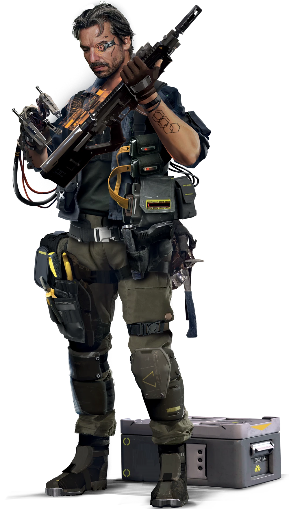

---
tags:
  - 🔧Técnico
aliases:
  - Techie
  - Técnico
---

>“Só porque o mundo se afundou na **merda** e foi colocado para secar, não significa que as coisas mudaram tanto. A vida nesta cidade ainda depende da **tecnologia** para impedir que tudo entre completamente em modo pós-apocalíptico. E isso significa que todos dependem de **mim**. Se seu liquidificador quebrar, é provável que você não encontre um novo no Mercado Noturno local por **semanas**. Talvez **meses**. E isso assumindo que você tenha uma relação boa com o Negociador local e ele queira te convidar. Enquanto isso, estou aqui, pronto para **consertar** seu liquidificador. E seu Agente. E o que mais você precisar. A tecnologia é a **alma** desta Cidade e eu? Eu sou o coração que mantém o sangue circulando. Pelo menos neste bairro.”
>João “Tocha” Barbosa Alves, Dono de Reparos Tocha

Você não deixa nada quieto - se ficar perto de você por mais de cinco minutos, você a desmonta e a transforma em algo novo. Sempre tem pelo menos duas chaves de fenda e uma chave inglesa nos bolsos. Computador quebrado? Sem problemas. O queimador de hidrogênio de carro parou de funcionar? Sem problemas. Não consegue reproduzir vídeos ou sua interface está falhando? Sem problemas. Você ganha a vida construindo, consertando e modificando - uma ocupação crucial em um mundo tecnológico que se recupera de uma Guerra que destruiu a cadeia de distribuição. Você pode fazer um bom dinheiro consertando coisas do dia a dia, mas, para ganhar grana de verdade, precisa dos trabalhos grandes. Armas ilegais. Cibertecnologia ilegal ou roubada. Equipamentos de espionagem e contraespionagem Corporativa para “operações clandestinas”. Se você for bom, estará ganhando muito dinheiro. Esse dinheiro via para novos dispositivos, hardware e informações. Seu trabalho no mercado negro não está só te trazendo amigos - também um número impressionante de inimigos - então você investe muito em sistemas de defesa e, se realmente for pressionado contra a parede, pede ajuda de um ou dois Solos. Você conserta clandestinas até a Sra. Zepa da esquina. Ninguém nunca voltou com uma reclamação, mas isso pode ser por causa das torres que protegem sua porta da frente. Você é viciado em tecnologia em todas as suas formas , é isso que te faz um Técnico.

## Habilidade de Cargo: Construtor
A habilidade de Cargo do Técnico é Construtor. Usando a Habilidade de Cargo Construtor, o Técnico pode consertar, melhorar, modificar, criar e inventar novos itens. Sempre que um Técnico aumenta sua Graduação em Construtor em 1 ele ganha 1 Graduação em duas Especializações de Construtor diferentes à sua escolha incluindo reparar, atualizar, fabricar e inventar.

Um Técnico pode consertar, melhorar. modificar, criar e inventar novos itens usando Construtor, sua Habilidade de Cargo. **Sempre que um Técnico aumentar sua Graduação em 1, ele ganha 1 Graduação em duas Especializações de Construtor diferentes (Especialização em Campo, Especialização em Melhorias, Especialização em Fabricação ou Especialização em Invenção) à sua escolha.**

### Especialização em Campo

Sua Familiaridade com a tecnologia no campo faz que você um ativo valioso em qualquer trabalho, especialmente quando algo quebra no momento errado. **Adicione sua Graduação nesta Especialidade a quaisquer Testes de Tecnologia Básica, Cibertecnologia, Tecnologia Eletrônica/de Segurança, Tecnologia de Armas e Tecnologia de Veículos Aéreos, Marítimos ou Terrestres que realizar para qualquer finalidade que não seja um teste de um Teste de Construtor.**

Além disso, se tiver pelo menos 1 Graduação nesta especialização, em vez de tentar um concerto de longo prazo, você pode optar por consertar temporariamente seu alvo (com o mesmo VD de um reparo normal desse item) para devolvê-lo à sua condição perfeita suando uma Ação (com seu PP ou PV completos, se aplicável). Você adiciona sua Graduação em Especialização em Campo nesse Teste. Esse improviso dura por 10 minutos para cada Graduação que tiver nesta especialidade, depois do qual o item retorna ao estado em que estava antes de ser consertado, exceto que não pode ser consertado novamente até que seja totalmente reparado.

### Especialização em Melhorias

Melhore um item de uma das seguintes maneiras. Um item só pode se beneficiar de 1 melhoria concedida por esta especialização

- Reduza a Perda de Humanidade de um cibernético que não seja equipamento borgue em 1d6 se sua Perda de Humanidade padrão for de 2d6 ou mais.
- Aumente em um o número de espaços de um tipo que o item já possui para customizações, acessórios, Programas/Hardware etc.
- Simplifique o item, reduzindo pela metade o tempo necessário para realizar qualquer conserto completo no futuro.
- Conceda a uma arma de uma mão, normalmente não ocultável, a capacidade de ser ocultada.
- Transforme uma Arma de Qualidade Padrão em uma Arma de Excelente Qualidade.
- Conceda um Espaço de Customização de uma arma a uma Arma Exótica.
- Permite que uma Arma Exótica dispare um tipo de Munição Não Básica do seu tipo de munição.
- Aumente o PP de um item em 1, mas apenas se o item tiver algum PP.
- Agregue a um veículo uma melhoria que requer apenas uma Graduação de 1 na Habilidade de Carga do Nômade.
- Instale uma melhoria inventada pelo Técnico por meio de Especialização em Invenção. Requer material adicional igual à Categoria de Preço atribuída ao item pelo MJ quando ele foi inventado.

**Para melhorar um item, você rola TEC + a Perícia Técnica com a qual o item normalmente é reparado + sua Graduação nesta especialização + 1d10**. O Técnico deve comprar materiais da mesma categoria de preço do item que está sendo melhorado, que são consumidos ao instalar a melhoria. o VD contra o qual ele deve rolar e o tempo necessário para instalar a melhoria se baseiam na categoria de preço do item que está sendo melhorado.

Se falhar no Teste durante a melhoria, você deve recomeçar do zero. O material adquirido para a melhoria e o item que seria aprimorado permanecem ilesos.

### Especialização em Fabricação

Fabrique um item existente ou um item inventado pelo Técnico com sua Especialização em Invenção. **Para isso, ele rola TEC + a Perícia Técnica com a qual o item normalmente é reparado + sua Graduação nesta especialidade + 1d10**. O Técnico deve comprar materiais de uma categoria de preço menor à categoria de preço do item que está sendo fabricado. (Exceto no caso de itens Muito Luxuosos que, para serem fabricados, necessitam de uma quantidade de material igual à metade do seu Preço).

O VD contra o qual ele deve rolar e o tempo necessário para fabricar o item se baseiam na categoria de preço do item que está sendo fabricado. Se falhar no Teste durante a fabricação, você deve recomeçar do zero. O material comprado para fazer o item está ileso.

Se falhar no Teste durante a fabricação, ele deve recomeçar do zero. O material adquirido para a fabricação continua ileso.

### Especialização em Invenção

Invente uma melhoria para um item existente ou invente um item totalmente novo. para inventar um item/melhorá-lo, é preciso descrever ao seu MJ a função desejada do item/melhoria da melhor forma que puder usando a linguagem das tecnologias já existentes no cenário, certificando-se de incluir o mecanismo pelo qual a invenção vai cumprir sua função. Sugerimos que você elabore um esquema simples para fins ilustrativos. Seu MJ e os outros Jogadores com certeza vão apreciar isso.

Se o MJ estiver satisfeito com sua explicação e de acordo com sua utilização no jogo, ele deve escrever como a invenção proposta funcionaria no contexto das regras, tomando cuidado para não criar um item desequilibrado. As melhorias apresentadas anteriormente em Especialização em Melhorias são uma boa diretriz para melhorias de tecnologias equilibradas. Com base no valor do item ou da melhoria, se ele fosse vendido no mercado, o MJ definirá a Categoria de Preço mais próxima possível de outros itens/melhorias de um “nível de poder” similar, embora a categoria mais baixa que ele pode selecionar é Caro.

O Teste par inventar o item/melhorá-lo usa sua **TEC + a Perícia Técnica associada ao reparo da invenção ou do item que a invenção pretende melhorar+ sua Graduação nesta especialidade + 1d10**.

O VD contra o qual você rola e o tempo que leva para criar o item se baseiam na categoria de preço do item que você está criando. Se falhar no Teste durante o processo de criação, você percebe que precisa voltar ao esboço inicial.

Uma vez inventado, você (ou outro Técnico para quem mostrou o projeto) pode fabricar/melhorar o item usando Especialização em Melhorias ou Fabricação! Vale a pena mencionar que ninguém vai prestar atenção na sua invenção antes que você tenha um protótipo funcional. Claro, aí também é quando tentarão roubá-lo. Não se preocupe com os tribunais.

Mais do que qualquer outra habilidade no jogo, esta é a que pode resultar em maior desequilíbrio. Seu MJ pode precisar alterar retroativamente a maneira como sua invenção opera, no que se refere às regras (ou, em circunstâncias extremas, até mesmo substitui-la por outra invenção com a mesma categoria de preço que vocês elaborem juntos), várias vezes antes que vocês encontrem uma versão que funcione bem e não afeta negativamente o equilíbrio do jogo.

---

### VD/Tempo de Melhoria/Fabricação/Invenção/Preço

|Custo|Preço|VD|Tempo|
|---|---|---|---|
|Barato|10eb|9|1 hora|
|Cotidiano|20eb|9|1 hora|
|Custoso|50eb|13|6 horas|
|Premium|100eb|17|1 dia|
|Caro|500eb|21|1 semana|
|Muito Caro|1.000eb|24|2 semanas|
|Luxuoso|10.000eb|29|1 mês|
|Muito Luxuoso|> 10.000eb|29|1 mês / 10.000eb|
