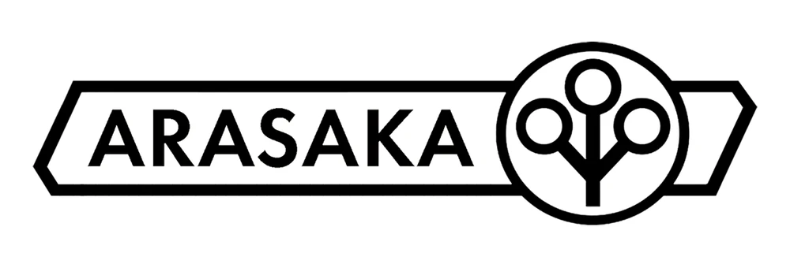

---
type:
  - Seguranca Corporativa
  - Polícia Corporativa
  - Diversas outras suboperações Corporativas
aliases:
  - Arasaka
---

# Arasaka
---
**Sede**: Tóquio, Japão
**Escritórios Regionais**: Escritórios ao redor do mundo
**Diretor:** Hanako Arasaka
**Funcionários**: 1.000.000História
---

## História

Se você quer proteger algo, eles ainda são as pessoas com quem você deve conversar. Mesmo depois de uma grande guerra, a Arasaka ainda mantém uma das maiores forçar armadas dentre as corporações. Embora suas operações estejam severamente reduzidas e sua sede esteja limitada ao continente japonês, a Arasaka conseguiu, mesmo derrotada, manter a maior parte dos seus ativos graças à sua forte aliança com o governo oficial do Japão.

Na maior parte do tempo, no pós-Guerra, as tropas de Arasaka estão secretamente licenciadas a outras empresas ao redor do mundo como guardas de segurança Corporativos, mensageiros e mercenários, mas geralmente vestindo os uniformes de seus novos “empregadores”. Como os agentes mais bem treinados e mais durões do mercado de segurança, eles seguem à risca as ordens de seus clientes, exceto quando em conflito com as ordens da Arasaka. No que se refere à Corporação Arasaka, eles são leais até a morte. A Arasaka está mais preocupada em proteger sues próprios ativos avariados do que proteger outras empresas, então ela muitas vezes usa sua posição de confiança com grandes Corporações ao redor do mundo para obter informações privilegiadas, contatos e vantagens que ajudarão a alcançar seu objetivo final de retornar ao patamar político e econômico que possuíam anteriormente.

A Arasaka pode estar nominalmente sob o controle de Saburo Arasaka, mas como acontece em qualquer organização poderosa, sempre existem facções competindo por dominância. A partir da década de 2040, existem três grandes facções lutando para chegar ao topo, sempre com a esperança de que o Velho Saburo lhes passe a coroa. As Facções da Arasaka em 2045 são:

**Facção Kiji (Faisão Verde)**: Liderada por Hanako, esta facção é basicamente uma continuação da linha principal, controlada pelo regime Saburo, Mas como Hanako é algo recluso, mas interessado em seus experimentos de Trilhar a Rede do que angariar poder, a facção Kiji basicamente tenta manter a Corporação de acordo com a visão arrebatadora de Saburo Arasaka.

**Facção Taka (Falcão)**: Liderada por Yorirobu, segundo filho de Saburo. Ele ainda é um renegado que se opõe às outras facções para alcançar seus próprios objetivos. Pensava-se que ele havia sido _Soulkiller_ por seu irmão mais velho Kei, mas no fim das contas, descobriu-se que a pessoa que foi assassinada era um dublê de corpo; durante a Guerra, Yorinobu se assegurou de que fosse impossível encontrá-lo. Enquanto seu pai Saburo (ou a Facção Kiji) estiver no controle, Yorinobu continuará por aí tentando derrubá-lo.

**Facção Hato (Pombo)**: Centrada em Michiko Sanderson (nascida Arasaka), única filha de Kei e neta de Saburo. Esta facção se aliou ao braço americano da Arasaka, mas a verdade é que o membro mais jovem do clã não que saber das maquinações de sua família. Contudo, como figura pública, a Facção Hato a considera um ativo valioso que lhes dará legitimidade caso assumam o comando após a morte de Saburo.

## Face: Hanako Arasaka

Hanako, a filha mais velha de Arasaka, sempre foi um pouco reclusa. Ela é uma [Trilha-Redes](../roles/netrunner) que sempre preferiu trabalhar nos seus projetos digitais, particularmente em uma versão revisada do _SoulKiller_, que permitiria mover-se a corpos clonados (só ela entendeu o verdadeiro significado do trabalho de Alt Cunningham). No entanto, com a queda de Kei, o restante da Velha Guarda (principalmente antigos comandados sob Kei) se uniu em torno dela, buscando continuar os planos de Saburo e de Kei como Facção Kiji. Eles representam a facção que espera uma reconciliação pacífica com os Novos EUA e Hanako é sua figura pública. Ela também é essencial para que seu irmão, Yorinobu, se reconcilie com a Família.