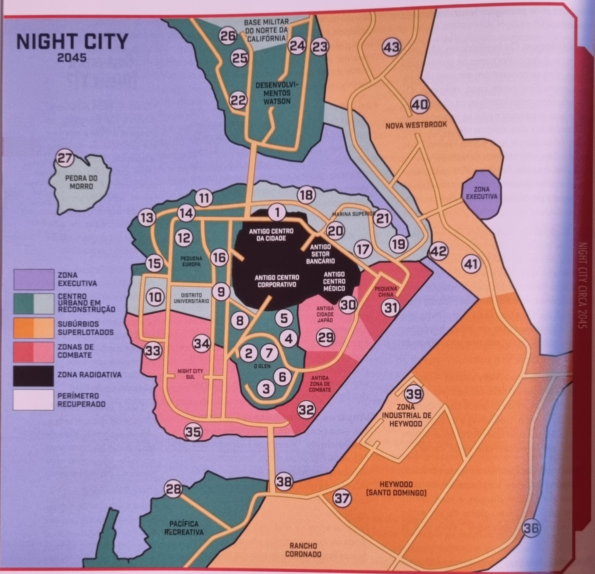

---
aliases:
  - NightCity
  - Night City
---
# Nigth City

Aqui onde você mora e vive, bem provável que conheça essa cidade por inteiro, mas se for novo vai querer um guia. Bem aqui esta seu guia para ir onde quiser.

## Zona Radioativa

> [!IMPORTANT]
>  **Classificação de Risco: Combate**

Essas são as áreas que costumavam compor a Zona Corporativa do centro da cidade. Embora grande parte dessa área tenha sido demolida e arrastada para a Baía como preenchimento, o restante é uma paisagem assombrada por arranha-céus colapsados e retorcidos, veículos queimados e os corpos sepultados dos sem sorte. Embora a radiação tenha diminuído, ela ainda está presente, e a maioria das pessoas abandonou a área, deixando-a para as piores gangues. Quem anda por aí, provavelmente é um membro de gangue, um suicida ou foi atraído para lá buscando encontrar tesouros escondidos nos destroços.

Antigos Bairros que fazem parte da desolada Zona Radioativa são:

**O Antigo Distrito Financeiro**: O Distrito Financeiro, lar de todos antigos bancos de Night City, está tomado por entulhos e nunca foi limpo oficialmente.

**O Antigo Centro da Cidade**: Restam apenas ruínas radioativas do outrora movimentado Centro de Cidade.

**O Antigo Centro Corporativo**: O Centro Corporativo, outrora o coração das Corporações de Night City é apenas uma ruína de sua antiga glória.

**O Antigo Centro Médico**: O Antigo Centro Médico, em grande parte tomado por radiação, abriga muitos hospitais enterrados sob escombros.

### Zona Radioativa
1. [Totentanz](nigthcity/radioactive_zone/totentanz.md)

## Centro Urbano em Reconstrução

> [!IMPORTANT]
>  **Classificação de Risco: Corporativo/Moderado**

Nem toda Night City foi obliterada no holocausto. Uma parte considerável do centro urbano sobreviveu, agora novamente tomado por arranha-céus e construções urbanas densamente povoadas. Mas a detonação e a destruição subsequente danificaram os diques e quebra-mares que impediam que a Baía e o Oceano Pacífico adentrassem o aterra em que se encontrava a maior parte do Centro da Cidade. Inundações periódicas são comuns, e o fornecimento de luz e água são inconstante, na melhor das hipóteses. Os serviços de metrô NCART ainda funcionam, quando não estão inundados pela maré; o setor de planejamento urbano está trabalhando para elevar a maior parte dos trilhos em uma nova configuração de monotrilhos, mas isso levará tempo e dinheiro que a cidade não tem.

Nos Centros em Reconstrução, guindastes e equipamentos de construção (como os ostentadores mecanoides [Zhirafa](https://www.notion.so/e09c8a8cb447403282101d4645b10191?pvs=21)) estão por toda parte. Os esqueletos gigantescos de novas torres Corporativas se erguem a partir das ruínas da Cidade Velha, patrulhados por exércitos privados sempre vigilantes e drones sentinela mecânicos. O trabalho nunca para e o Centro está sempre agitado com os estrondos de máquinas pesadas e o brilho das luzes dos arcos de construção. Dentre as principais novas construções estão os crescentes megaedifícios na Zona Urbana em Recuperação Watson; miniarcologias com tudo incluído, projetadas para abrigar os milhões de pessoas que foram forçadas a deixar suas casas quando a Bomba explodiu.

Os bairros que fazem parte do Centro Urbano em Reconstrução são:
### Glen

Um florescente novo distrito que contém a maior parte dos edifícios governamentais importantes de Night City.

%%{:start="2"}%%

2. [1° Banco de Night City](nigthcity/glen/first_bank_night_city)
3. [Câmara Municipal](nigthcity/glen/city_council)
4. [1° Delegacia de Polícia da Cidade](nigthcity/glen/first_police_station_in_the_city)
5. [Clube Atlantis](nigthcity/glen/atlantis_club)
6. [Palácio da Justiça](nigthcity/glen/palace_justice)
7. [Escritórios da Merrill, Asukaga e Finch](nigthcity/glen/merrill_asukaga_and_finch_offices)
8. [Microcibernética Raven](nigthcity/glen/raven_microcybernetics)

### Distrito Universitário

Um bairro estreito às margens da Zona de Combate que abriga a única universidade ainda em funcionamento da cidade

%%{:start="9"}%%
9. [Campus da Biotechnica](nigthcity/university_district/biotechnica_campus)
10. [Universidade de Night City](nigthcity/university_district/nightcity_university)

### Pequena Europa

Um distrito segmentado que abriga vizinhanças compactas compostas tanto por construções de tijolos quanto altos arranha-céus.

%%{:start=11}%%
11. [Corte Camden](nigthcity/little_europe/camden_court)
12. [Escritórios da Continental Brands](nigthcity/little_europe/continental_brands_offices)
13. [Escritórios da Danger Gal](nigthcity/little_europe/danger_gal_offices)
14. [Igreja dos Santos Anjos](nigthcity/little_europe/church_of_the_holy_angels)
15. [2° Corpo de Bombeiros de Night City](nigthcity/little_europe/second_nightcity_fire_department)
16. [Curto-Circuito](nigthcity/little_europe/short_circuit)

### Marina Superior

Um distrito urbano movimentado com uma mistura de antigas zonas industriaise fistintos bairros de estilo “Internacional” construídos em torno de uma marina bem-conservada.

%%{:start="17"}%%

### Desenvolvimento Watson

### Base Militar do Norte da Califónia

### Pedra do Morro

### Pacífica Recreativa

## Zona Executiva

> [!IMPORTANT]  
> **Classificação de Risco: Executivo**

Essa é uma área especial da Cidade fechada e fortemente defendida, reservada para uso exclusivo de executivos Corporativos de alto escalão e suas famílias. Além das residências luxuosa, ela abriga seu próprio shopping e instalações recreativas, incluindo campos de golfe, spas privados e clubes.

## Zonas de Combate

> [!IMPORTANT] 
> **Classificação de Risco: Combate**

As gangues são os soberanos absolutos das Zonas de Combate. Espreitando entre as favelas, os cortiços e as ruínas de quarteirões abandonados, as gangues e seus aliados se dividem pelo território, controlam seus recursos limitados e matam qualquer um ou qualquer coisa que entre em seus caminhos. Não existem reconstruções em andamento em Zonas de Combate, embora, de tempos em tempos, Oficiais da Lei Corporativos ou Municipais descendem sobre a área como uma tonelada de concreto, chacinando membros de gangues - um processo que a Cidade caracteriza como “aparar á trepadeira”.

Os Bairros que fazem parte das Zonas de Combate são:

## Subúrbios Superlotados

> [!IMPORTANT]
>  **Classificação de Risco: Moderado/Combate**

No pós-Guerra, a maior parte do centro de Night City se encontrava inabitável, não por causa da radiação residual, mas pela perda de energia, estogo e abastecimento de água. Os subúrbios se tornaram o lar de diversas cidades-barracos e campos de refugiados não regulamentados comprimidos onde antes “Beaversvilles”. Embora enormes megaedifícios estejam em construção para abrigar refugiados, essa região está superlotada, dominada pelo crime e sempre à beira do desatre.

Os bairros que se encontram nos Subúrbios Superlotados são:

## Perímetro Recuperado

> [!IMPORTANT]
> **Classificação de Risco: Periférico**

Embora Night City fosse o núcleo regional, ela era cercada por uma constelação de cidade e subúrbios menores. A maior parte deles foi abandonado durante o período entre 2000 e 2020, pois se encontravam muito afastados para conseguirem se proteger das gangues de motoqueiros itinerantes que assolavam a área.

Agora, com o apoio de Famílias Nômades e de segurança privada, os Reconstrutores buscam construir novos lares para os refugiados da Cidade em muitos desse lugares abandonados.

**As Cidades vizinhas que fazem parte do Perímetro Recuperado são**: Atascadero, Praia Avila, Cambria, Los Osos, Paso Robles, Praia Pismo, São Luis Obispo e São Simeão.

## Autopistas

> [!IMPORTANT]
> **Classificação de Risco: Periférico**

Na década de 2020, as Autopistas eram lar de gangues de motoqueiros e caravanas Nômades bem defendidas. Mas na medida em que as Famílias Nômades assumiram maior controle sobre o comércio e o transporte mundial, elas começaram a usar equipamentos militares excedentes para expulsar as gangues e tornar as estradas mais seguras para a locomoção.

As estradas ainda são extensas e áridas, cobertas de veículos queimados em determinadas áreas, mas a cada dia que passa, as Autopistas se parecem mais com a Rota 66 do que com Mad Max.

**Velhas rodovias que fazem parte das Autopistas são**: a Rota 41 do Estado da Califórnia, Rota 46 do Estado da Califórnia, Rota 58 do Estado da Califórnia, Rota 99 do Estado da Califórnia, Rota 828 do Estado da Califórnia, Rodovia Interestadual 5 e Rodovia Interestadual 101.