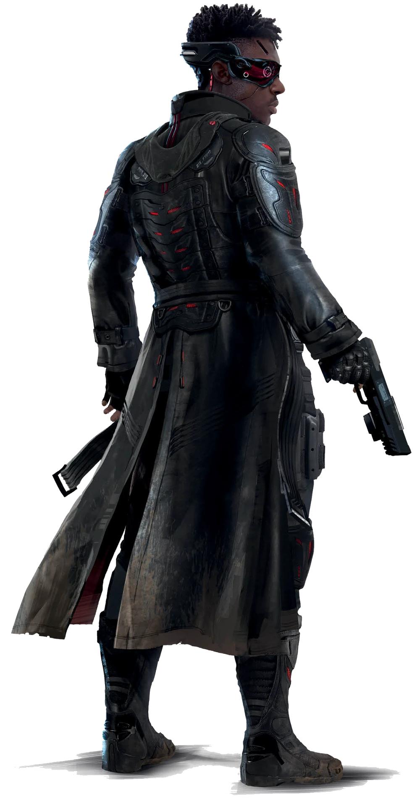

---
tags:
  - 💶Negociador
aliases:
  - Fixer
  - Negociador
---
# 💶 Negociador

> “Pense em mim como um **intermediário**. Se você precisar de uma equipe de assassinos, um  carro novo, uma antiguidade rara? Eu sou seu homem. Pagamento? **Eurobucks**, claro, e talvez um favor aqui ou ali. Tenho certeza de que você tem talentos de algum outro **cliente** vai se interessar. É tudo uma grande teia e eu estou no **centro**. Na semana passada, eu peguei uma carona até a Zona de Combate para buscar um carregamento de explosivos que faria o **DPNC** ter um ataque cardíaco. Amanhã, eu tenho um encontro no Mercado Noturno para vender um caminhão cheio de hardware para os Iron Sights. Eu não preciso **saber** o que vão fazer com isso. Como eu disse, eu sou apenas o **intermediário**”.
>Graxa, Negociador

Você percebeu rapidamente que nunca conseguiria um emprego Corporativo ou seria durão suficiente para ser um Solo. Mas você sempre soube que tinha um talento especial para descobrir o que as pessoas precisam e como conseguir isso para elas. Por um preço, é claro. Agora você já não negocia trocados, mas sim coisas importantes. Talvez você movimente armas ilegais pela fronteira. Ou roube e revenda suprimentos médicos. Talvez você venda suas habilidades atuando como agente de Solos e Trilha-Redes, ou contrate grupos de Nômades para assegurar o contrato de clientes. Você compra e venda favores como um padrinho da Máfia à moda antiga. Você tem conexões em todos os tipos de negócios e grupos políticos. Você usa seus contatos e aliados como parte de uma vasta teia de intriga e coerção. Se há uma boate quente na Cidade, você está envolvido. Se houver uma guerra entre facções acontecendo, você está negociando com os dois lados, de olho em quem pode ganhar. Mas você não está nisso só pelo dinheiro. Se alguém precisa esfriar, você o esconde. Você consegue um teto para quem precisa e traz comida quando as ruas estão bloqueadas. Talvez você faça isso porque sabe que eles vão ficar te devendo, mas você não tem certeza. Você é uma parte Robin Hood e duas partes de Al Capone. No passado, eles o teriam chamado de senhor do crime. Mas este é o fragmentado, desagradável e letal  Tempo do Vermelho. Então, agora eles te chamam de Negociador.

# Habilidade de Cargo: Operador

A Habilidade de Cargo do Negociador é o Operador. Negociadores sabem como obter as coisas no mercado negro e estão acostumados a navegar os complexos costumes sociais da Rua, onde colidem com as centenas de culturas e níveis econômicos. Negociadores mantêm vastas redes de contato e de clientes com quem podem buscar bens, favores ou informações. Os Negociadores também podem obter recursos desejáveis e fazer negócios favoráveis.

A Habilidade de Cargo do Negociador é Operador. Negociadores sabem como obter as coisas no mercado negro e estão acostumados a navegar os complexos costumes sociais Da Rua, onde colidem centenas de culturas e níveis econômicos. Negociadores mantêm vastas redes de contatos e de clientes.

**Contatos & Clientes** representa quem o Negociador pode contatar para obter bens, favores ou informações. O Negociador ainda terá que pagar por isso, é claro.

**Alcance** indica a maior Categoria de Preço de itens que um Negociador pode obter **a qualquer momento** e se ele pode usar sua influência para reunir outros Negociadores na criação de um Mercado Noturno, o que torna todas as Categorias de Preço de itens disponíveis para ele por um curto período de tempo.

**Pechinchar** é a habilidade do Negociador de fazer um acordo. Ao pechinchar, ele rola **MOR + sua Perícia de Comercio + sua Graduação em Operador + 1d10** contra **MOR + a Perícia de Comércio + a Graduação em Operador (no caso de outro Negociador) + 1d10** do alvo. Se for bem-sucedido, ele pode realizar **1** acordo da sua Graduação em Operador ou inferior. **Apenas 1 acordo de Negociador pode ser feito por transação.**

**Liso** representa a habilidade do Negociador de se misturar com  as muitas culturas dentro e fora Da Rua; sua capacidade de reconhecer o idioma, os códigos sociais e o status de cada grupo ou cultura.

## Graduação em Operador

### Operador em Graduação 1 e 2

**Contatos & Clientes**: Chefão local, líder de gangue ou alguma liderança da vizinhança

**Alcance**: Ele sempre consegue um lugar para comprar itens Baratos e Cotidianos, mesmo por algum motivo eles não estejam disponíveis.

**Pechinchar**: Se for bem-sucedido, ele pode obter 10% a mais ou menos que o preço de mercado ao comprar ou vender.

**Liso**: Ele conhece os meandros culturais da sua vizinhança próxima, incluindo todas as gangues locais.

### Operador em Graduação 3 e 4

**Contatos & Clientes**: Chefão de uma gangue da Cidade, político menor, Executivo Corporativo, pessoa conhecida na vizinhança

**Alcance**: Ele sempre consegue um lugar para comprar itens Caros, mesmo que por algum motivo eles não estejam disponíveis.

**Pechinchar**: Se for bem-sucedido, ao comprar 5 ou mais do mesmo item, ele pode receber um adicional gratuito.

**Liso**: Ele sabe como lidar com pelo menos 1 outra cultura em sua área, além de receber um Idioma que ele não conhece associado a essa cultura no Nível 4.

### Operador em Graduação 5 e 6

**Contatos & Clientes**: Figurões importantes da Cidade, político da Cidade, celebridades locais

**Alcance**: Uma vez por mês, trabalhando com outros Negociadores da sua mesma Graduação, ele pode estabelecer um Mercado Noturno. Enquanto estiver no Mercado Noturno que ajudou a organizar, ele sempre consegue encontrar itens Muito Luxuosos.

**Pechinchar**: Se for bem-sucedido, ele pode negociar um pagamento 20% superior por pessoa por um Trabalho.

**Liso**: Ele sabe como lidar com 2 culturas adicionais (3 no total) em sua área, além de receber um Idioma que ele não conhece associado a cada cultura no Nível 4.

### Operador em Graduação 7 e 8

**Contatos & Clientes**: Presidente da Corporação Local, prefeito ou conselheiro da Cidade, celebridade da Cidade.

**Alcance**: Ele sempre consegue um lugar para comprar itens Muito Caros, mesmo que por algum motivo eles não estejam disponíveis.

**Pechinchar**: Se for bem-sucedido, ao comprar um item Luxuoso ou Muito Luxuoso, ele pode pagar metade no momento e a outra metade em um mês. Se *ele não pagar a segunda metade em dia, ninguém fará esse acordo com ele novamente*.

**Liso**: Ele sabe como se misturar perfeitamente com 3 culturas adicionais (6 no total) em sua área, além de receber um Idioma que ele não conhece associado a cada cultura no Nível 4

### Operador em Graduação 9

**Contatos & Clientes**: Chefe de Divisão de uma Corporação, político Estatal, celebridade famosa

**Alcance**: Ele sempre consegue um lugar para comprar itens Luxuosos, mesmo que por algum motivo eles não estejam disponíveis. Ao estabelecer um Mercado Noturno, ele pode escolher criar um segundo Mercado Noturno dentro desse, reunindo a liderança do submundo do crime.

**Pechinchar**: Se for bem-sucedido, ele pode obter 20% a mais ou a menos que o preço do mercado ao comprar ou vender.

**Liso**: Ele sabe como se misturar perfeitamente, não apenas com muitas culturas em sua área, mas também com as Corporações e agências governamentais.

### Operador em Graduação 10

**Contatos & Clientes**: Importante líder mundial, importante chefe de Corporação, celebridade mundialmente conhecida

**Alcance**: Ele sempre consegue um lugar para comprar itens Muito Luxuosos, mesmo que por algum motivo eles não estejam disponíveis.

**Pechinchar**: Se for bem-sucedido, ele pode negociar o dobro do pagamento por pessoa por um trabalho

**Liso**: Ele pode se misturar perfeitamente com quase qualquer grupo, incluindo grupos muito especializados ou fechados, como sociedades secretas, cultos ou clubes com membros exclusivos.