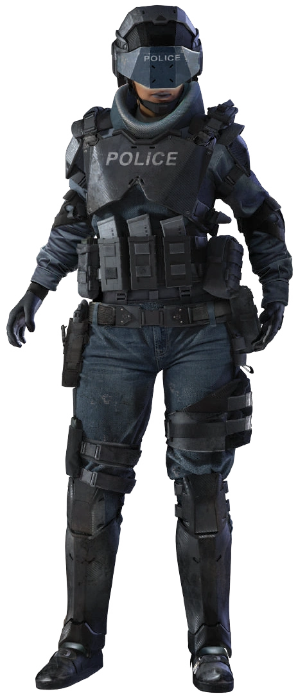

---
tags:
  - 👮Homem_da_Lei
aliases:
  - Lawman
  - Homem da Lei
---
# 👮Homem da Lei

> “Ouça, moleque, nos chame como **quiser**. Homens da lei, distintivos, **porcos**. Não importa. A cidade está em **ruínas** e cada vez mais vemos as pessoas atrapalhando a reconstrução. Vagabundos, ciberpsicopatas, grupos terroristas, o pior dos **piores**. Eu não estou nisso pela glória nem para **agitar** minha arma por ai como algum Solo figurão. Eu fiz um juramento para manter esta cidade segura e eu levo isso a sério. Alguém tem que manter as ruas seguras para que civis como você possam ir até o mercado sem levar uma bala perdida da última guerra de gangues. Esse sou **eu**.
> Oficial Suri “Cavalaria” Navarro, DPNC.

Nos velhos tempos antes da Guerra, costumavam tentar atirar em policiais. Agora você terá sorte se for pego por só uma bala. A Rua é difícil hoje em dia, cheia de drogas, gangues e armas novas que fazem um Minami-10 parecer um brinquedo de criança. Mas, mesmo assim, você está por aí fazendo o que pode para Proteger - e Servir.

Costumava haver uma grande Força da Cidade, mas a maior parte da Velha Guarda do DPNC foi deixada por conta própria para manter a paz como passam. Os que ficam levam o distinto a sério; eles trabalham para manter as pessoas seguras e tentam resistir contra o caos. Mesmo que você preferisse uma carga mais leve, se você é um Homem da Lei que se leva a sério, você precisa carregar pelo menos quatro armas de alto calibre, a maior parte delas automáticas, e um colete de Kevlar®, que vai parar o impacto de até 260 metros por segundo - e ainda assim, muitas vezes você enfrentará armas mais poderosas e estará em menor número. Para começar, metade das gangues foram ciberizadas: supervelocidade, super-reflexos, enxergavam no escuro, armas nos braços… e isso foi antes da Guerra e da Queda das Torres, que encheram os Mercados Noturnos de dispositivos cibernéticos. A outra metade dos caras Na Rua são mercenários freelancers de Corporações, que costumavam ter empregos durante a Guerra; contratados para compor exércitos Corporativos agora dissolvidos pelo esquadrão de capanga e você está tentando mantê-los sob controle também. Os Policiais Corporativos costumavam ter armas pesadas, armadura de combate completam reforço da Divisão de Trauma, veículos de assalto AV-4 e girocópteros com minimetralhadoras. Mas os setores limpos da cidade, cheios de novos prédios com escritórios e restaurantes chiques - onde nenhum psicopunk aprimorado nunca faria uma matança com uma FN-RAL37 - quase não existem mais. Agora são principalmente prédios queimados e carros abandonados, onde cada noite há um novo tiroteio e mais um oportunidade perfeita para uma morte desagradável. Ou você pode criar um Esquadrão Psicopata e trabalhar caçando ciborgues bem armados e blindados que enlouqueceram. Um ciberpsicopata pode caminhar por rajadas de metralhadora e não sentir nada, então, muitos do Esquadrão Psicopata acabam ficando um pouco loucos também; eles carregam drogas para aprimorar os sentidos, têm armas enormes e saem por aí sozinhos para caçar ciborgues. Mas você não é tão louco. Ainda.

# Habilidade de Cargo: Reforços

A Habilidade de Cargo do Homem da Lei é Reforços. Com esta habilidade, os Homens da Lei podem pedir a ajuda de um grupo de agentes da lei, de acordo com a Graduação do Homem da Lei e as condições sob as quais ele faça o chamado. Os Reforços estarão armados e blindados com base em sua Graduação.

A Habilidade de Cargo do Homem da Lei é Reforços. Com esta habilidade, os Homens da Lei podem pedir a ajuda de um grupo de agentes da lei, de acordo com a Graduação do Homem da Lei e nas condições sob as quais ele faça o chamado. Os Reforços estarão armados e blindados com base na tabela abaixo e o Teste é realizado pelo MJ.

Na medida em que um Homem da Lei aumenta sua Graduação, é provável que ele seja promovido dentro de sua organização atual ou recrutado por outras agências de aplicação da lei de onde poderá chamar Reforços.

**Quando estiver em perigo**, ele pode chamar Reforços de um grupo de sua Graduação em Reforços ou inferior. Usando uma Ação, ele deve tentar rolar um valor igual ou menor à sua Graduação em Reforços com 1d10 para alguém responda ao seu chamado. **Se abusar disso, seu chefe o expulsará da força ou o multará como achar melhor.**

Depois que respondem ao chamado, ele rolda um d6 para descobrir em quantas Rodadas os Reforços chegaram no local. Se obtiver um 6 nessa rolagem, em vez dos Reforços normais, ele receberá a ajuda de uma Graduação em Reforços superior, a menos que já possua Graduação 10; nesse caso, duas equipes de reforços chegarão ao local. **Se ninguém responder ao chamado, o Homem da Lei pode tentar novamente no próximo Turno.**

## Graduação em Reforços

**Número de Combate**: Uma Base de Perícia usada tanto de forma ofensiva como defensiva. Esse número combina tanto a Estatística como a Perícia. Os Reforços devem adicionar uma rolagem de d10 a este valor sempre que realizarem um ataque com suas armas ou equipamentos ou para se defenderem. **Reforços não podem desviar de balas.**

**PP**: O poder de parada da armadura tanto no Corpo como na Cabeça.

**PV**: A quantidade de Pontos de Vida que cada membro do reforço possui.

**MOV & CORPO**: As Estatística de MOV e CORPO dos reforços, importantes para movimento e alguns efeitos que fazem referência ao MOV ou CORPO do alvo (como Testes de Morte).

### Reforços em Graduação 1 e 2

**Número de Combate**: 8

**PP**: 7

**PV**: 20

**MOV & CORPO**: 4

**Segurança Corporativa**: Quatro policiais locais chegam a pé à cena. Eles carregam Pistolas Pesadas e usam Kevlar®.

### Reforços em Graduação 3 e 4

**Número de Combate**: 10

**PP**: 7

**PV**: 25

**MOV & CORPO**: 5

**Policiais Locais**: Quatro policiais locais em ronda. Eles chegam em dois Carros Terrestre Compactos. Eles carregam Pistolas Pesadas e usam Kevlar®.

### Reforços em Graduação 5 a 7

**Número de Combate**: 14

**PP**: 13

**PV**: 35

**MOV & CORPO**: 4

**Departamento de Xerife**: Duas agentes locais do departamento do Xerife que patrulham os arredores e as estradas da Cidade. Elas chegarão em um Carro de Alta Performance, armados com Pistolas Pesadas e Fuzis de Assalto, suando Jaqueta Blindadas Pesadas.

### Reforços em Graduação 8

**Número de Combate**: 16

**PP**: 15

**PV**: 50

**MOV & CORPO**: 6

**Delegado de uma Zona em Recuperação**: Como os delegados do Velho Oeste eles são Homens da Lei solitários que patrulham as Zonas em Recuperação e novas cidades. Um deles chega em uma Supermoto carregando uma Pistola Pesada, Fuzil de Assalto, Lança-Granadas e vestindo um Colete à Prova de Balas.

### Reforços em Graduação 9

**Número de Combate**: 15

**PP**: 18

**PV**: 35

**MOV & CORPO**: 6

**C-SWAT**: Dois pesos pesados do Esquadrão Psicopata. Eles carregam Fuzis de Assalto e Lança Foguetes e usam Armadura Metalgear®. Chegam voando em um AV-4

### Reforços em Graduação 10

**Número de Combate**: 14

**PP**: 11

**PV**: 35

**MOV & CORPO**: 6

**Agentes Federais/Interpol/FBI/Netwatch**: Esses são realmente os pesos pesados, operando sob o controle do governo federal ou de grupos internacionais de aplicação da lei. Eles viajam em dupla, chegam em um AV-4 e estão equipados com Pistolas Muito Pesadas, Fuzis de Assalto e Jaqueta Blindada Leve.

Diferente dos outros tipos de Reforços, esses pesos pesados permanecem no local depois do conflito e ajudam a investigar a cena. Eles não seguirão com seu grupo, mas depois da primeira chamada, os mesmo 2 agentes sempre responderão a pedidos de reforço que estejam relacionadas à chamada inicial até que o caso esteja encerrado ou até que eles sejam eliminados no cumprimento do dever.

Além disso eles podem usar seu Número de Combate para as seguintes Perícias: Contabilidade, Atuação, Ocultar/Revelar Objeto, Criminologia, Criptografia, Dedução, Educação, Falsificação, Interrogação, Paramédico, Percepção, Cuidados Pessoais, Resistir à Tortura/Drogas, Furtividade e Rastreamento.