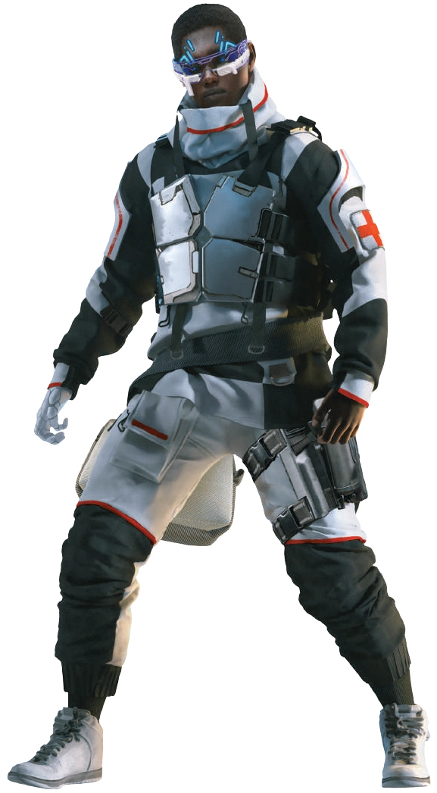

---
tags:
  - 💉Tecnomédico
aliases:
  - Medtech
  - Tecnomédico
---
# 💉 Tecnomédico

> “Eu conserto o que está **quebrado** desde que era jovem. A primeira vez foi quando um pássaro se chocou com o vidro da nossa Kombi na estrada das ruínas de Los Angeles. Estávamos viajando **sozinhos**, e meu velho, sabendo que eu era sensível a esse tipo de coisa, parou de dirigir e deixou sair para pegar a carcaça. Acabou que era um falcão de cauda vermelha ainda vido. Imobilizei sua asa quebrada e **cuidei** dele até se recuperar. Mamãe viu o que eu fiz e me colocou de aprendiz com o **curandeiro** do Bando. Agora, eu que sou o curandeiro. Não, não tenho **iniciais** depois do meu nome, mas ainda posso **consertar** esse braço quebrado. Ou você pode perdê-lo. Você escolhe”
> Virgil “Rabo de Cavalo” Martinez

Você é um artista e o corpo humano é sua tela. Você tem as melhores ferramentas que o Tempo do Vermelho pode oferecer e sabe come usá-las. Se tiver sorte, você poderá frequentar uma das verdadeiras escolas de medicina espalhadas pelos destroços dos Antigos Estados Unidos. Depois da Guerra, os hospitais militares estavam por toda parte e os poucos médicos na linha de frente precisavam de ajuda para segurar os pacientes, que gritavam enquanto juntavam suas partes cibernéticas. Então, talvez você tenha aprendido assim.
Sempre há um ou outro velho Medicânico por aí que escutam de novo aquela velha história de ficção científica chamada *Blade Runner, o Caçador de Androides* - não aquele velho vídeo de tela plana, mas o livro de ficção científica realmente antigo sobre médicos renegados que realizavam cirurgias ilegais na rua em dos primeiros romances distópicos. Talvez um desses caras tenha treinado você. Talvez você seja assim agora, ajudando os feridos, cuidando dos doentes e mantendo os moradores locais vivos. Por amor, compromisso ou talvez apenas por uma bolada for fora.
Se você for realmente sortudo, conseguiu uma vaga na Divisão da Trauma. A Divisão da Trauma é um grupo de paramédicos licenciados que patrulham a cidade em busca de pacientes. Você opera em um Veículo de Assalto Urbano AV4, redesenhado em uma configuração de ambulância e armado com uma minimetralhadora. É o melhor dos melhores - a Divisão de Trauma cobra uma taxa de assinatura pesada para salvar seus clientes, e isso resulta em novos brinquedos médicos, ambulâncias AV mais rápidas e salários altos para os melhores cirurgiões.
Não importa como você chegou aqui. O que importa é que você está aqui, Na Rua, fazendo seu trabalho. E você estaria fazendo isso não importa o motivo. É o que o torna um Tecnomédico.
## Habilidade de Cargo: Medicina

A Habilidade de Cargo do Tecnomédico é Medicina. Com essa habilidade, os Tecnomédicos podem usar seus conhecimentos, ferramentas e treinamento para manter vivos os que deveriam estar mortos. No Tempo do Vermelho, eles são tanto mecânicos quanto médicos, cuidando de pessoas que muitas vezes são mais máquinas que humanos. Sempre que um Tecnomédico aumenta sua Graduação em Medicina, ele também escolhe uma das três especializações de Medicina para atribuir 1 ponto: cirurgia, farmacêutica ou operação de sistemas criogênicos.
A Habilidade de Cargo do Tecnomédico é Meidicina. Os Tecnomédicos mantêm vivas aspessoas que deveriam estar mortas com seu conhecimento e treinamento. No Tempo do Vermelho, eles são tanto mecânicos quantos médicos, cuidandos de pessoas que muitas vezes são mais máquinas que humanos. **Sempre que um Tecnomédico aumenta sua Graduação em Medicina, ele também escolhe uma das três seguintes Especializações de Medicina (Cirurgia, Medicina Tecnológica (Farmacêutica) ou Medicina Tecnológica (Operação de Sistemas Criogênicos)) para atribuir 1 ponto.**
A seção Indo para o Hospital contém utilizações adicionais para Cirurgia e Medicina Tecnológica que estão disponíveis apenas para Tecnomédicos por meio desta Habilidade de Cargo. Isso inclui instalação e coleta de Cibernéticos, Escultura Corporal e Terapia!
### Cirurgia
Para cada ponto designado a Cirurgia, você ganha 2 pontos na Péricia ne Cirurgia (até um máximo de 10). A Perícia Cirúrgia é a Perícia Técnica usada para tratar as Lesões Críticas mais severas, bem como implantes de cibernéticos, e só esta disponivel para Tecnomédicos por meio desta Especialização de Medicina.
### **Medicina Tecnológica (Farmacêutica)**
Para cada ponto que designar a Medicina Tecnológica (Farmacêutica), você ganha 1 ponto na Perícia Medicina Tecnológica (até um máximo de 10). A Perícia Medicina Tecnológica é a Perícia Técnica usada para operar, compreender e reparar (assim como outras Perícias Técnicas que não são de veículos) maquinário médico. Esta Perícia só esta disponível para Tecnomédicos por meio desta Especialização de Medicina ou Operação de Sistemas Criogênicos. Você só pode designar um máximo de 5 pontos a esta especialização.
Sempre que designar um ponto em Farmacêutica, você também ganha acesso a um dos seguintes produtos farmacêuticos, que seu Personagem pode sintetizar rolando um Teste de Medicina Tecnológica VD13, desperdiçando qualquer material usado no caso de uma falha. Ao longo de uma hora, com 200eb de material, um Tecnomédico pode sintetizar um número de doses igual à sua Perícia Medicina Tecnológica. Ele não pode sintetizar Drogas de Rua com Medicina Tecnológica (Farmacêutica).

| Farmacêuticos | Efeitos 
| --- | --- |
| Antibiótico | Quando injetado com um dose de Antibiótico, um alvo que já iniciou o processo de cura natural cura 2 Pontos de Vida adicionais por dia durante uma semana. Uma pessoa só pode se beneficiar do uso de um Antibiótico por vez. |
| Cura Rápida | Quando injetado com uma dose de Cura Rápida, um alvo que não apresenta um Estado de Ferimento Mortalmente Ferido cura imediatamente uma quantidade de PV igual ao seu COPPO + VONT. Uma pessoa só pode se beneficiar de um uso de Cura Rápida por dia. |
| Desintoxicação Rápida | Quando  injetado com uma dose de Desintoxicação Rápida, um alvo afetado por uma droga, veneno ou intoxicante é imediatamente purgado dos efeitos dessa sustância. |
| Estimulante | Quando injetado com uma dose de Estimulante, um alvo pode ignorar todas as penalidades do Estado de Ferido Gravemente Ferido por uma hora. Uma pessoa só pode se beneficiar do uso de Estimulantes uma vez por dia. |
| Surto | Quando injetado com uma dose de Surto, um alvo pode funcionar rem restrições sem dormir por 24 horas completas. Uma pessoa só pode se beneficiar do uso de Surto uma vez por semana. |

A aplicação de uma única dose de uma droga toma uma Ação. Se o alvo não estiver de acordo, o Tecnomédico pode usar sua Ação para realizar um único Ataque Corpo a Corpo com seu Injetor contra o alvo, administrando uma única dose no alvo em vez de causar dano.

Um Personagem que não seja um Tecnomédico não pode administrar Farmacêuticos corretamente. Essas não são Drogas de Rua, elas requerem treinamento para alcançar a dose de medicamento correta.
### **Medicina Tecnológica (Operação de Sistemas Criogênicos)**

Para cada ponto que designar a Medicina Tecnológica (Operação de Sistemas Criogênicos), você ganha 1 ponto na Perícia Medicina Tecnológica (até um máximo de 10). A Perícia Medicina Tecnológica é a Perícia Técnica usada para operar, compreender e reparar (assim como outras Perícias Técnicas que não são de veículos) maquinaria médica. Esta Perícia só está disponível para Tecnomédicos por meio desta Especialização de Medicina ou Farmacêutica. Você só pode designar um máximo de 5 pontos nesta especialização.

Sempre que designar um ponto a Operação de Sistemas Criogênicos, você também ganha um dos benefícios detalhados abaixo:

| Nível | Benefício                                                                                                                                                                                                                                                         |
| ----- | ----------------------------------------------------------------------------------------------------------------------------------------------------------------------------------------------------------------------------------------------------------------- |
| 1     | Com 1 ponto em Operação de Sistemas Criogênicos, você ganha uma Cápsula Criogênica.                                                                                                                                                                               |
| 2     | Com 2 pontos em Operação de Sistemas Criogênicos, você se torna um Técnico Registrado em Tanques Criogênicos e ganha acesso ilimitado, 24 por 7, a 1 Tanque Criogênico por vez em qualquer instalação operada por corporações médicas ou agências governamentais. |
| 3     | Com 3 pontos em Operação de Sistemas Criogênicos, você ganha 1 Tanque Criogênico, instalado em um local de sua escolha.                                                                                                                                           |
| 4     | Com 4 pontos em Operação de Sistemas Criogênicos, você ganha 2 Tanques Criogênicos adicionais no mesmo local que o primeiro e suas Cápsulas Criogênicas têm 2 cargas e sua capacidade máxima de carga aumenta para 2 pessoas em estase.                           |
| 5     | Com 5 pontos em Operação de Sistemas Criogênicos, você ganha 3 Tanques Criogênicos adicionais no mesmo local que os três primeiros e suas Cápsulas Criogênicas têm 3 cargas e sua capacidade máxima de carga aumenta para 3 pessoas em estase.                    |
