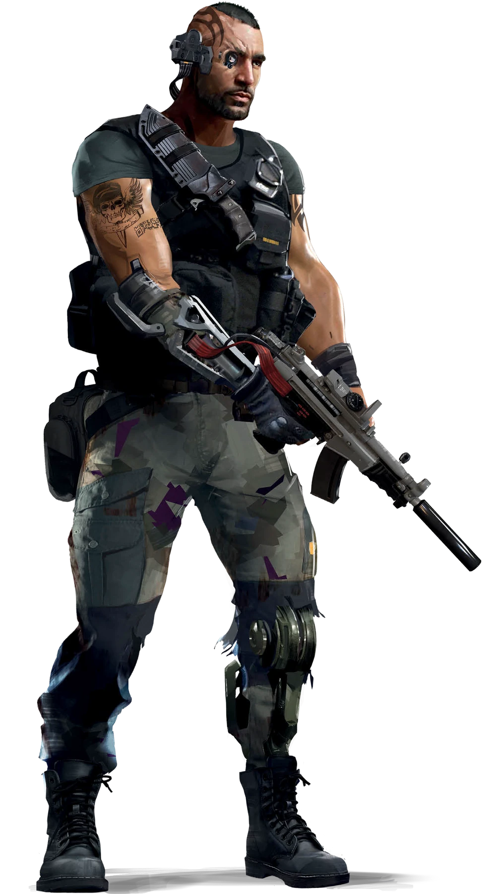

---
tags:
  - 🔫Solo
aliases:
  - Solo
---
# 🔫 Solo

> “Com quem eu me juntaria? Estava cansado de passar **fome** e ser **pobre**. Quando a Militech ofereceu um teto e uma cama, pode acreditar que eu me inscrevi. As primeiras missões não eram ruins. A terceira falhou miseravelmente. Não seu por que, mas eles enviaram um esquadrão de **novatos** contra um monte de ciborgues completos. Só dois de nós sobreviveram. Depois da Guerra, peguei o novo **cromo** que os médicos Corporativos me deram e fui trabalhar por conta própria. Acontece que , quando uma cidade é **destruída** e reconstruída, muita gente está disposta a **pagar** por um certo conjunto de habilidades. Ainda bem que eu sou uma delas.”
>  Abril “Movedora” Montella, contratante privado

Você renasceu com uma arma na mão; a mão de carne e osso, não a fábrica mecânica de armas que cobre a maior parte do seu outro braço. Seja como guarda freelancer, assassino de aluguel, ou como um cibersoldado Corporativo que faz cumprir os contratos, ou organizar as “operações clandestinas” das Corporações, você é uma máquinas de combate de elite do Tempo do Vermelho. A maioria dos Solos tem experiência militar da Quarta Guerra Corporativa, em um exército Corporativo, ou em uma das “ações policiais” recentes acontecendo em todo o país. À medida que os traumas dos conflitos se Cibermembros para armas e armaduras, chips de bioprogramas para aumentar seus reflexos e percepção, drogas de combate para dar vantagem sobre seus oponentes. Quando você for o melhor dos melhores, talvez até deixe as fileiras dos samurais Corporativos e se torne um ronin - vendendo seus talentos letais como assassino, guarda-costas ou mercenário para quem puder pagar suas altas taxas. Gostou? Mas tem um preço - um preço alto. Você perdeu muito da carne original do seu corpo, você é quase uma máquina. Seus reflexos de matar são tão aprimorados que você tem que se conter para não ficar frenético a qualquer momento. Anos usando drogas de combate para ter vantagem trouxeram vícios horríveis. Existem poucas pessoas em quem você pode confiar. Uma noite você pode dormir em um condomínio de cobertura na cidade, na próxima pode estar em um beco imundo Na Rua. Mas esse é o preço de ser o melhor. E você está disposto a pagá-lo. Porque você é um Solo.

## Habilidade de Cargo: Percepção de Combate

A Habilidade de Cargo do Solo é Percepção de Combate. Com Percepção de Combate, um Solo pode usar seu treinamento par ater mais consciência situacional no campo de batalha. Fora do combate, quando um combate começou durante um combate usando uma Ação, um Solo pode dividir o número total de pontos que possui em Percepção de Combate entre uma série de habilidades de combate. Se um Solo decidir não mudar sua divisão de pontos, ela continuará sendo a anterior. A ativação de algumas dessas habilidades custa mais pontos que outras.
Fora do combate, quando um combate começa (antes de rolar a Iniciativa) ou durante um combate usando uma Ação, um Solo pode dividir o número total de pontos que possui em Percepção de Combate entre as seguintes habilidades. Se um solo decidir não mudar sua divisão de pontos, ela continuará sendo a anterior. A ativação de algumas dessas habilidades custa mais pontos que outras:

### Deflexão de Dano
Você foi treinado a esquivar-se, reduzindo o dano causado a você
- Por 2 pontos, diminua o primeiro dano que você receber a cada Rodada em 1.
- Por 4 pontos, diminua o primeiro dano que você receber a cada Rodada em 2.
- Por 6 pontos, diminua o primeiro dano que você receber a cada Rodada em 3.
- Por 8 pontos, diminua o primeiro dano que você receber a cada Rodada em 4.
- Por 10 pontos, diminua o primeiro dano que você receber a cada Rodada em 5.

### Reagir ao Recuo
Você foi treinado para reagir instantaneamente a contratempos, tomando seu tempo a cada tipo. Por 4 pontos, você ignora Falhas Críticas (1) que rolar enquanto ataca. No entanto, essas rolagens ainda são tratadas como 1.
### Reação de Iniciativa
Seus reflexos são treinados para responder instantaneamente, sem pensar, no início de um tiroteio. Cada ponto adiciona +1 aos Testes de Iniciativa.
### Ataque Preciso
Você foi treinado para mirar com atenção, concedendo-lhe maior precisão.
- Por 3 pontos, você adiciona +1 a quaisquer Ataques que realizar.
- Por 6 pontos, você adiciona +2 a quaisquer Ataques que realizar.
- Por 9 pontos, você adiciona +3 a quaisquer Ataques que realizar.
### Ponto Fraco
Você foi treinado para encontrar os pontos fracos que permitem danificar até mesmo alvos fortemente blindados. Cada ponto adiciona +1 ao dano (antes da armadura) do seu primeiro ataque bem-sucedido em uma Rodada.
### Detectar Ameaças
Você aumentou sua consciência situacional. Cada ponto adiciona +1 aos seus Testes de Percepção.